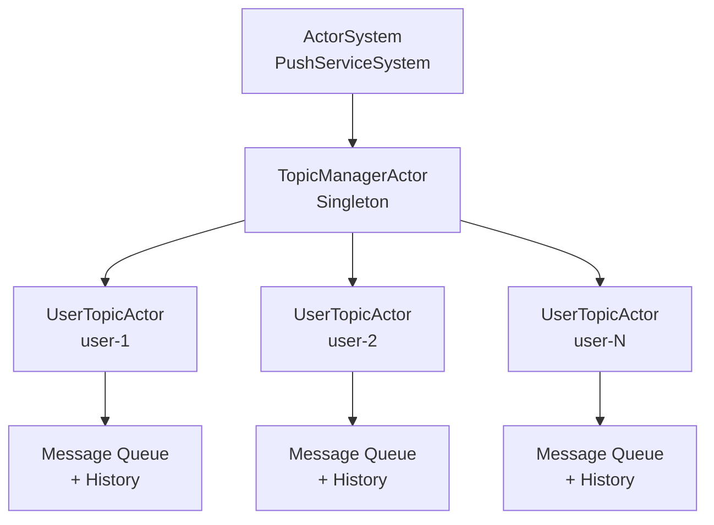
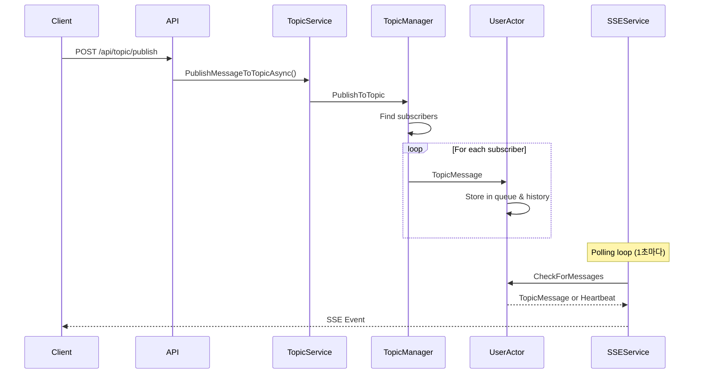
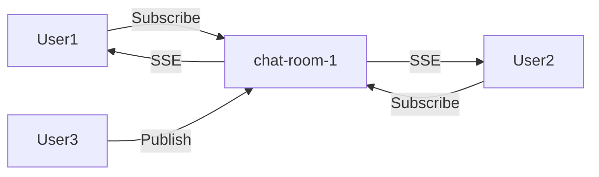
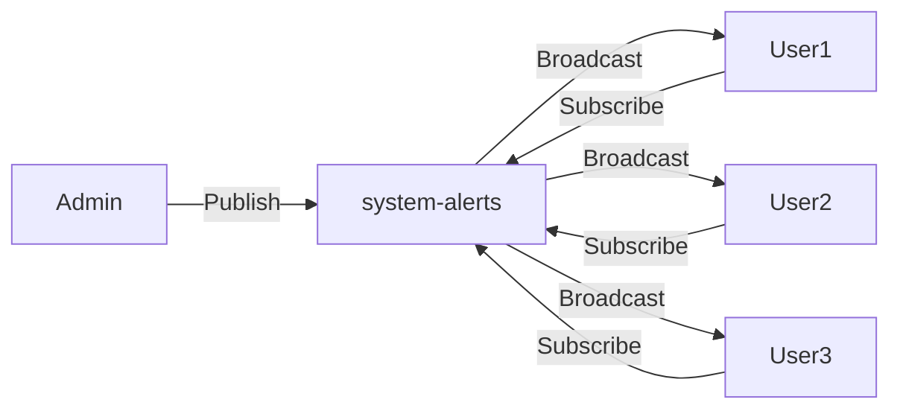

# PushServiceNet - Real-time Push Notification Service

## 개요

PushServiceNet은 ASP.NET Core와 Akka.NET 액터 모델을 기반으로 구축된 실시간 푸시 알림 서비스입니다. Server-Sent Events (SSE)를 활용하여 실시간 통신을 구현하며, 오프라인 사용자를 위한 메시지 히스토리 기능을 제공합니다.

## 주요 특징

- 🚀 **실시간 푸시 알림**: SSE를 통한 단방향 실시간 통신
- 📢 **토픽 기반 발행/구독**: 토픽별 메시지 라우팅
- 💾 **메시지 히스토리**: 사용자당 최대 100개 메시지 저장
- 🎭 **액터 모델**: Akka.NET을 활용한 상태 관리
- 🔄 **자동 재연결**: 하트비트를 통한 연결 상태 관리
- 🧪 **테스트 클라이언트**: 웹 기반 대화형 테스트 도구

## 시스템 아키텍처

### 액터 시스템 구조



### 메시지 흐름도



## API 엔드포인트

### 1. 토픽 구독
```http
POST /api/topic/subscribe
Content-Type: application/json

{
    "userId": "user1",
    "topicName": "topic-a"
}
```

### 2. 토픽 구독 해제
```http
POST /api/topic/unsubscribe
Content-Type: application/json

{
    "userId": "user1",
    "topicName": "topic-a"
}
```

### 3. 메시지 발행
```http
POST /api/topic/publish
Content-Type: application/json

{
    "topicName": "topic-a",
    "content": "Hello, World!",
    "senderId": "publisher1"  // Optional
}
```

### 4. 메시지 히스토리 조회
```http
GET /api/topic/history/{userId}
```

### 5. SSE 연결
```http
GET /api/sse/connect/{userId}
```

## SSE 이벤트 형식

### 메시지 이벤트
```javascript
event: message
id: 550e8400-e29b-41d4-a716-446655440000
data: {
    "id": "550e8400-e29b-41d4-a716-446655440000",
    "event": "message",
    "topic": "topic-a",
    "data": "Hello, World!",
    "timestamp": "2024-01-13T10:30:00Z",
    "senderId": "publisher1"
}
```

### 하트비트 이벤트
```javascript
event: heartbeat
data: {"timestamp":"2024-01-13T10:30:00Z"}
```

## 프로젝트 구조

```
PushServiceNet/
├── PushServiceNet/
│   ├── Actors/
│   │   ├── TopicManagerActor.cs    # 토픽 및 구독 관리
│   │   └── UserTopicActor.cs       # 사용자별 메시지 관리
│   ├── Controllers/
│   │   ├── TopicController.cs      # REST API 엔드포인트
│   │   └── SSEController.cs        # SSE 연결 엔드포인트
│   ├── Models/
│   │   ├── ActorMessages.cs        # 액터 통신 메시지
│   │   ├── Topic.cs                # 토픽 모델
│   │   ├── TopicMessage.cs         # 메시지 모델
│   │   ├── UserSubscription.cs     # 구독 정보 모델
│   │   └── SSENotification.cs      # SSE 알림 모델
│   ├── Services/
│   │   ├── AkkaService.cs          # Akka 시스템 관리
│   │   ├── TopicService.cs         # 비즈니스 로직
│   │   └── SSEService.cs           # SSE 연결 관리
│   ├── wwwroot/
│   │   └── index.html              # 테스트 클라이언트
│   └── Program.cs                  # 애플리케이션 진입점
└── PushServiceNetTest/
    └── TopicSubscriptionTests.cs   # 유닛 테스트

```

## 핵심 컴포넌트

### TopicManagerActor
- 모든 토픽과 구독 관계 관리
- 사용자 액터 생성 및 관리
- 메시지 라우팅 담당

### UserTopicActor
- 사용자별 구독 토픽 목록 관리
- 메시지 큐 및 히스토리 관리 (최대 100개)
- SSE 전송을 위한 메시지 대기열 처리

### SSEService
- SSE 연결 수명 주기 관리
- 1초마다 메시지 폴링
- 하트비트를 통한 연결 유지

## 사용 시나리오

### 시나리오 1: 실시간 채팅


### 시나리오 2: 시스템 알림


## 실행 방법

### 1. 프로젝트 빌드
```bash
dotnet build
```

### 2. 서버 실행
```bash
dotnet run --project PushServiceNet
```

### 3. 테스트 클라이언트 접속
브라우저에서 `http://localhost:5000` 접속

### 4. 유닛 테스트 실행
```bash
dotnet test
```

## 테스트 시나리오

### 1. 선택적 메시지 전달
- User1은 topic-a 구독, User2는 topic-b 구독
- topic-a로 메시지 발행 시 User1만 수신

### 2. 메시지 히스토리
- 오프라인 상태에서 발생한 메시지를 최대 100개까지 조회 가능

### 3. 다중 사용자 브로드캐스트
- 동일 토픽을 구독한 모든 사용자가 메시지 수신

## 성능 고려사항

- **액터 모델**: 동시성 처리 및 상태 격리
- **메시지 히스토리 제한**: 메모리 사용량 관리 (100개)
- **SSE 폴링 주기**: 1초 (조정 가능)
- **하트비트**: 연결 상태 모니터링

## 확장 가능성

1. **영구 저장소**: 메시지 히스토리를 데이터베이스에 저장
2. **클러스터링**: Akka.Cluster를 활용한 분산 처리
3. **인증/인가**: JWT 토큰 기반 보안
4. **메시지 필터링**: 사용자별 맞춤 필터
5. **우선순위 큐**: 중요도에 따른 메시지 처리

## 라이선스

이 프로젝트는 MIT 라이선스 하에 배포됩니다.